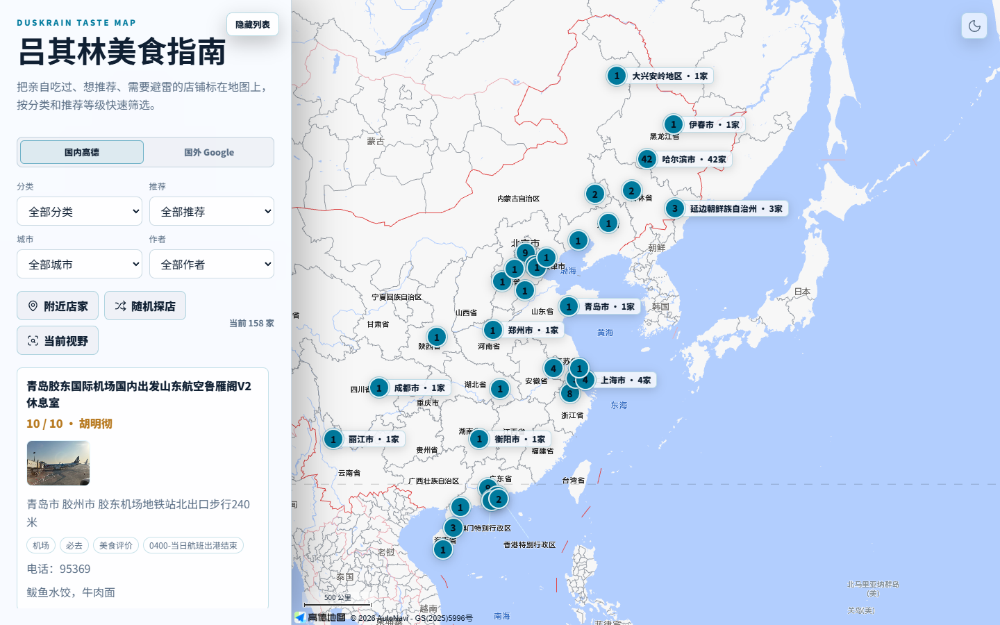
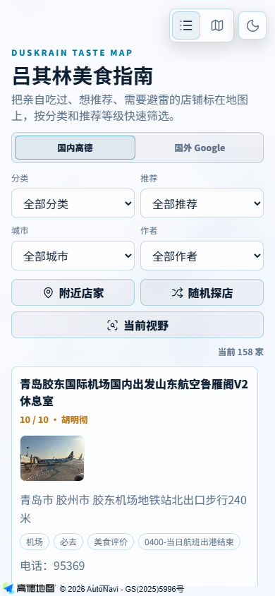
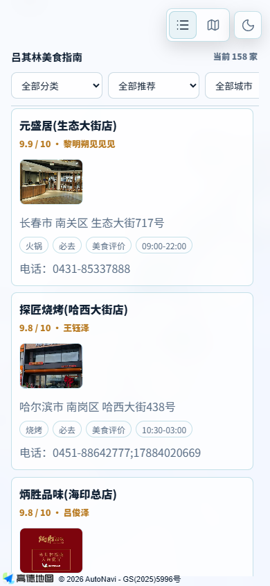
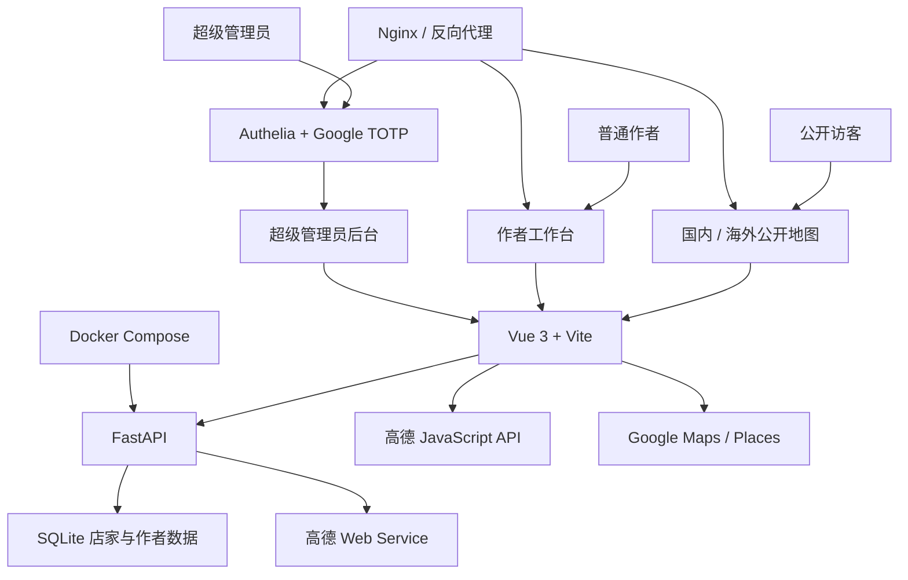

<h1 align="center">DuskRain 吕其林美食指南</h1>

<p align="center">
  
</p>

<p align="center">
  基于高德地图与 Google Maps 的个人美食地图、店铺资料库和评价系统。
</p>

<p align="center">
  
  
  
  
</p>

<p align="center">
  <a href="https://duskrain.cn/food-map/">
    
  </a>
  <a href="https://duskrain.cn/food-map/global/">
    
  </a>
</p>

## 项目简介

DuskRain 吕其林美食指南是一个自用的跨地图美食资料库。国内店家使用高德 POI 和 GCJ-02 坐标，海外店家使用 Google Places 和 WGS84 坐标；评分、作者、推荐等级、图片和长篇评价由本站独立保存。

项目重点不是抓取第三方点评内容，而是把地图基础信息与个人评价结合起来，形成可以持续维护的个人美食指南。

它同时解决三个问题：公开页面负责按城市、作者、菜系和推荐等级发现店家；作者工作台负责低成本录入和维护自己的评价；超级管理员负责统一的数据质量、账号和权限治理。地图提供商只负责位置与 POI 基础资料，个人评分与评论始终由本站数据库管理。

## 实际界面

### 桌面端国内地图



### 移动端列表与渐进收纳

<table>
  <tr>
    <td align="center"><strong>完整筛选与探索操作</strong></td>
    <td align="center"><strong>滚动后的紧凑浏览模式</strong></td>
  </tr>
  <tr>
    <td align="center"></td>
    <td align="center"></td>
  </tr>
</table>

## 核心工作流

1. 管理员或作者通过高德 / Google 搜索候选店家，或者直接点击地图选点。
2. 系统保存平台 POI ID，并补全名称、地址、坐标、电话、营业时间、行政区和详情链接。
3. 作者填写个人评分、推荐等级、多选菜系、图片、标签和 Markdown 长评。
4. 后端按作者锁定数据归属，同作者重复记录优先合并信息更完整的一条。
5. 公开页面按菜系、推荐、城市、作者、附近距离或当前地图视野筛选，并同步更新列表和地图标记。
6. 国内数据可转换为 WGS84 后显示在 Google 地图，但不会缓存或搬运任何地图瓦片。

## 功能亮点

- 国内高德地图和海外 Google Maps 分离展示。
- 管理端支持高德、Google Places 搜索候选店铺并点击加入。
- 超级管理员后台继续由 Authelia 与 Google TOTP 保护，可管理全部店家和作者账号。
- 独立作者工作台使用应用内账号登录，首次登录强制修改临时密码，只能管理本人名下的店家。
- 普通作者工作台支持高德与 Google 地图选点、搜索新建和固定作者批量导入；作者字段由后端自动锁定。
- 同一地图 POI 可由不同作者分别评价，权限归属以 `rating_author` 为准。
- 管理端支持粘贴“编号 店名 城市或地址 评分 推荐等级 作者 菜系”清单，一键匹配高德 POI、补全资料并批量新建；多个菜系使用“、”分隔。
- 推荐等级支持“必去 / 推荐 / 一般 / 避雷”；未填写时按评分自动设置，作者未填写时默认为吕俊泽，菜系写入个人分类。
- 城市或地址不完整时使用模糊搜索，并自动采用本站匹配分最高的第一个候选。
- 同一店家允许不同作者分别保存评价；同作者重复导入时自动合并非空字段，保留信息更完整的一条。
- Google 管理端提供 249 个国家和地区的中英文快速选择。
- 支持直接点击地图 POI 导入商家，点击空白位置反向解析地址。
- 自动保存平台 POI ID、地址、电话、营业时间、类型、坐标和平台详情链接。
- 个人评分、评分作者、推荐等级、多选菜系、标签、备注、图片和 Markdown 评价。
- 地图点位显示评分与店家名，点击后打开统一信息卡片。
- 国内地图支持城市聚合、店家标签和日夜模式。
- 海外地图按 Google 店铺分类筛选，并支持日夜底图切换。
- 海外地图可选同步显示国内高德店家，自动进行 GCJ-02 到 WGS84 转换。
- 海外页面的菜系、城市、作者、列表和点位共用同一数据集合：开启国内同步后自动加入国内选项，关闭后自动移除。
- 桌面端侧栏管理，移动端列表和地图快速切换。
- 国内与海外首页均提供附近店家、随机探店、当前视野、结果数量和条件式重置筛选。
- 移动端商家列表采用渐进式收纳：随滚动依次缩短品牌说明、地图来源、同步项和探索操作，最终只保留结果数、重置入口与横向筛选器；回滑时按相反顺序恢复。
- 本地安全 GitHub 发布脚本，默认屏蔽环境变量、数据库、备份和构建文件。

## 页面入口

- 国内地图：[https://duskrain.cn/food-map/](https://duskrain.cn/food-map/)
- 海外地图：[https://duskrain.cn/food-map/global/](https://duskrain.cn/food-map/global/)
- 管理端：`/food-map/admin/`，由网站认证层保护
- 作者工作台：`/food-map/developer/`
- 店家评价：`/food-map/review/{店家ID}`

## 架构



## 权限模型

| 身份 | 登录方式 | 数据权限 |
| --- | --- | --- |
| 公开访客 | 无需登录 | 查看公开店家、筛选、地图联动和评价 |
| 普通作者 | 独立作者账号 | 新建店家，只能修改或删除 `rating_author` 属于自己的记录 |
| 超级管理员 | Authelia + Google TOTP | 管理全部店家、作者账号、数据归属和公开状态 |

作者密码使用 PBKDF2 哈希，服务端会话只保存令牌哈希。首次登录可以强制修改临时密码，停用或重置账号会注销已有会话。

## 数据原则

- `map_provider`: `amap` 或 `google`
- `coordinate_system`: `gcj02` 或 `wgs84`
- `provider_poi_id`: 高德 POI ID 或 Google Place ID
- `provider_category`: 地图提供商返回的店铺类型
- `my_category`: 首个用户菜系，保留用于兼容旧客户端
- `my_categories`: 用户菜系列表，JSON 数组，可多选
- Google 地图展示国内点时只转换本站保存的坐标，不抓取或缓存高德底图。
- 不把第三方地图瓦片、Google 图片或第三方点评正文保存到仓库。

## 快速开始

1. 复制环境变量模板：

```powershell
Copy-Item .env.example .env
```

2. 在 `.env` 中配置自己的高德和 Google Maps 凭据。

3. 启动容器：

```powershell
docker compose up -d --build
```

4. 本地访问：

```text
http://127.0.0.1:8091/
http://127.0.0.1:8091/global/
http://127.0.0.1:8091/admin/
```

## 前端开发

```powershell
cd frontend
npm install
npm run dev
```

生产构建：

```powershell
npm run build
```

验证批量清单解析：

```powershell
npm run test:bulk-import
```

## 安全发布到 GitHub

首次使用时双击：

```text
Publish to GitHub.cmd
```

脚本会询问空 GitHub 仓库地址。后续再次双击即可检查、提交并推送安全文件。

仅执行隐私检查：

```powershell
powershell -ExecutionPolicy Bypass -File .\scripts\publish-github-safe.ps1 -AuditOnly
```

发布白名单包括源码、Docker 配置、依赖清单、README 和技术文档。以下内容不会发布：

- `.env` 和真实 API Key
- SQLite 数据库和店家数据
- 服务器配置、密码与认证信息
- `backups/`、`data/`、日志和报告
- `node_modules/`、`dist/` 和运行时静态构建

## 重要文件

- [app.py](app.py)：FastAPI API、数据库迁移和高德服务端代理。
- [frontend/src/components/PublicMap.vue](frontend/src/components/PublicMap.vue)：国内地图。
- [frontend/src/components/GlobalMap.vue](frontend/src/components/GlobalMap.vue)：海外地图。
- [frontend/src/components/AdminDashboard.vue](frontend/src/components/AdminDashboard.vue)：管理端总控。
- [frontend/src/components/AdminAuthors.vue](frontend/src/components/AdminAuthors.vue)：超级管理员作者账号管理。
- [frontend/src/components/DeveloperDashboard.vue](frontend/src/components/DeveloperDashboard.vue)：普通作者登录与本人店家管理。
- [frontend/src/components/DeveloperMapPicker.vue](frontend/src/components/DeveloperMapPicker.vue)：普通作者高德与 Google 地图选点。
- [frontend/src/components/AdminBulkImport.vue](frontend/src/components/AdminBulkImport.vue)：批量解析、匹配、去重和新建。
- [frontend/src/utils/google-map.js](frontend/src/utils/google-map.js)：Google Maps、Places 和坐标转换。
- [docs/PROJECT_MEMORY.md](docs/PROJECT_MEMORY.md)：项目长期技术记忆。
- [docs/google-maps-notes.md](docs/google-maps-notes.md)：Google Maps 接入决策。
- [docs/amap-js-api-v2-notes.md](docs/amap-js-api-v2-notes.md)：高德 JS API 优化记录。

## 安全说明

- 浏览器地图 Key 必须限制为指定网站来源。
- 服务端 Web Service Key 不应出现在前端或 GitHub。
- Google Maps 和 Places API 应设置 API 限制、预算提醒和调用配额。
- 管理端必须继续由反向代理认证保护。
- 作者密码使用 PBKDF2 哈希保存，会话令牌仅保存 SHA-256 哈希；停用或重置账号会注销已有会话。
- 本项目是个人美食记录工具，不提供第三方平台评分复制或商业数据采集。
