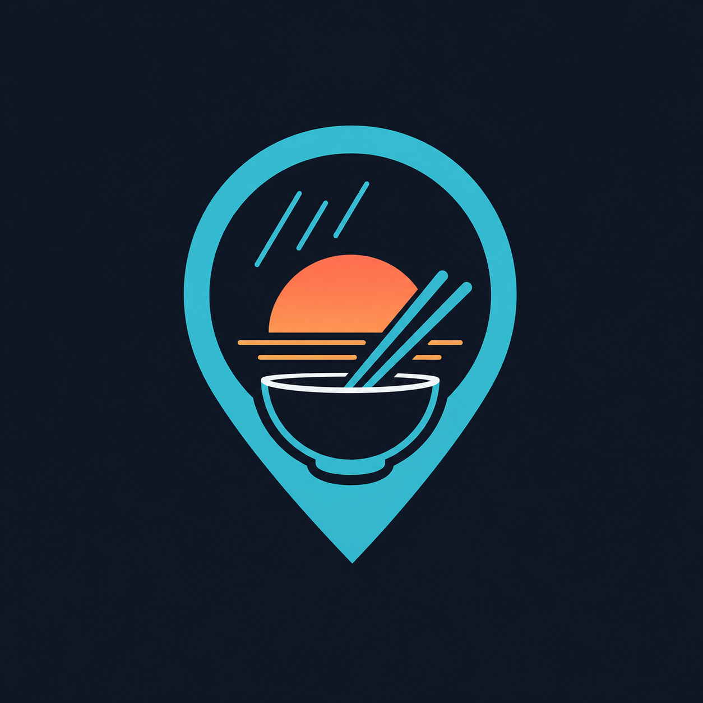
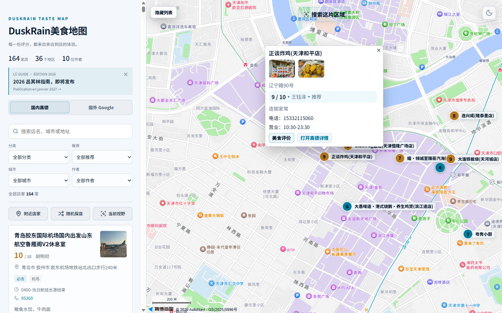
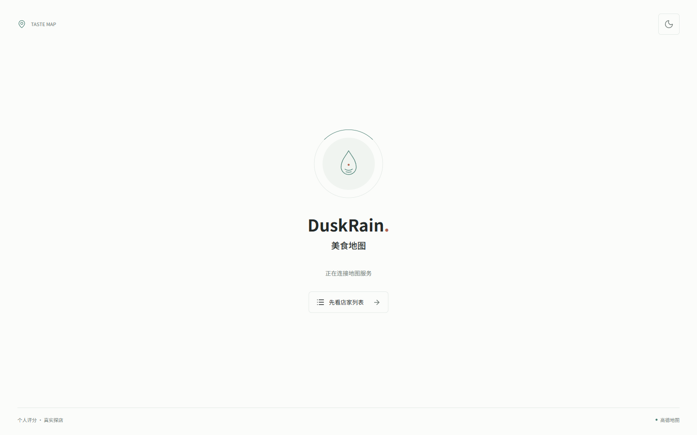
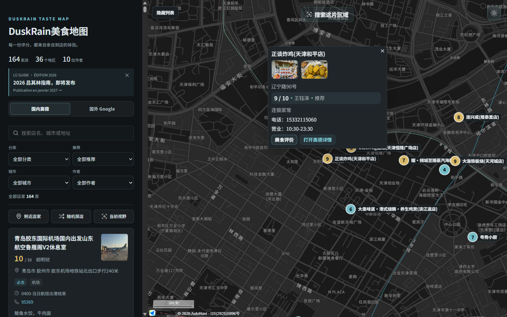
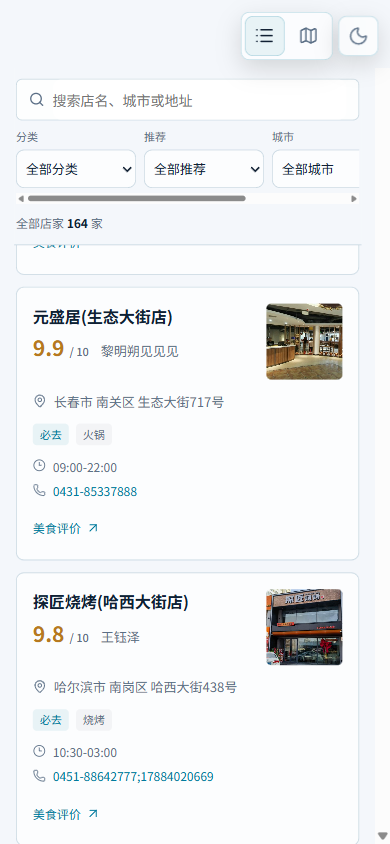
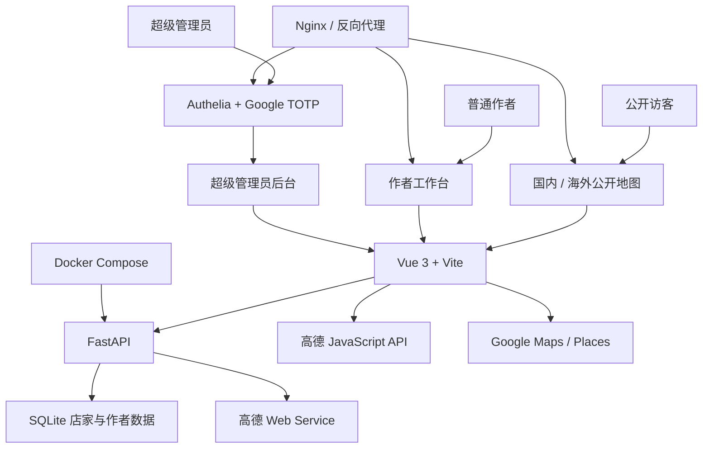

<h1 align="center">DuskRain 吕其林美食指南</h1>

<p align="center">
  
</p>

<p align="center">
  基于高德地图与 Google Maps 的个人美食地图、店铺资料库和评价系统。
</p>

<p align="center">
  
  
  
  
</p>

<p align="center">
  <a href="https://duskrain.cn/food-map/">
    
  </a>
  <a href="https://duskrain.cn/food-map/global/">
    
  </a>
</p>

## 项目简介

DuskRain 吕其林美食指南是一个自用的跨地图美食资料库。国内店家使用高德 POI 和 GCJ-02 坐标，海外店家使用 Google Places 和 WGS84 坐标；评分、作者、推荐等级、图片和长篇评价由本站独立保存。

项目重点不是抓取第三方点评内容，而是把地图基础信息与个人评价结合起来，形成可以持续维护的个人美食指南。

它同时解决三个问题：公开页面负责按城市、作者、菜系和推荐等级发现店家；作者工作台负责低成本录入和维护自己的评价；超级管理员负责统一的数据质量、账号和权限治理。地图提供商只负责位置与 POI 基础资料，个人评分与评论始终由本站数据库管理。

## 实际界面

以下截图来自 2026-10-04 的线上页面，保留地图来源标识。店铺数量、作者与评分是当时的公开展示快照，不是仓库内置数据。

### 桌面端国内地图



### 全屏加载与夜间浏览

<table>
  <tr>
    <td align="center"><strong>全屏加载与列表入口</strong></td>
    <td align="center"><strong>地图、侧栏与信息窗体统一夜间主题</strong></td>
  </tr>
  <tr>
    <td></td>
    <td></td>
  </tr>
</table>

### 移动端连续浏览

<p align="center">
  
</p>

向下浏览时，标题和概览自然滚出，搜索、筛选和结果数量保持可见。店名、评分与作者自动换行；进入评价页再返回，恢复之前的筛选与列表位置。

## 本次更新 · 2026-10-04

| 改动 | 浏览体验 |
| --- | --- |
| 全屏加载 | 覆盖地图和侧栏，跟随地图与首次店家数据的真实状态结束；支持日夜切换、失败重试和先看列表 |
| 统一店家卡片 | 国内、海外共用图文布局，完整展示店名、评分和作者，支持选中反馈、电话及评价链接 |
| 连续浏览 | 原生滚动与吸顶筛选，筛选后定位首条结果；手动滚动或点击可以接管自动滚动 |
| 探索操作 | 关键词搜索、附近店家、随机探店、当前视野与条件重置；普通筛选保留地图视角 |
| 加载与地图更新 | 页面按需加载，公开请求有超时处理，复用聚合与已有标记；地图卸载时释放资源 |

加载过程不模拟百分比，也不人为延迟。支持键盘操作和系统“减少动态效果”偏好。功能检查记录见[首页优化记录](docs/HOMEPAGE_OPTIMIZATION_20261003.md)和[全屏加载与侧栏验证](docs/FULLSCREEN_AND_SIDEBAR_20261004.md)。

## 核心工作流

1. 管理员或作者通过高德 / Google 搜索候选店家，或者直接点击地图选点。
2. 系统保存平台 POI ID，并补全名称、地址、坐标、电话、营业时间、行政区和详情链接。
3. 作者填写个人评分、推荐等级、多选菜系、图片、标签和 Markdown 长评。
4. 后端按作者锁定数据归属，同作者重复记录优先合并信息更完整的一条。
5. 公开页面按菜系、推荐、城市、作者、附近距离或当前地图视野筛选，并同步更新列表和地图标记。
6. 国内数据可转换为 WGS84 后显示在 Google 地图，但不会缓存或搬运任何地图瓦片。

## 功能亮点

### 找到想去的店

- 国内高德地图与海外 Google Maps 独立入口，支持日夜主题、地图与列表切换。
- 按关键词、菜系、推荐等级、城市和作者组合筛选，地图点位与列表同步。
- 附近店家默认筛选 30 公里并按距离排序，无结果时可主动扩大到 100 公里；定位需要浏览器授权。
- 随机探店从当前结果选择一家；移动地图后可以搜索当前区域。
- 国内地图支持城市聚合，店家点展示评分与名称，点击打开地址、电话、营业时间和评价入口。
- 海外地图可选显示国内店家，转换坐标并同步更新分类选项；关闭同步时移除国内结果及对应选项。

### 记录与维护

- 高德与 Google Places 搜索、地图 POI 点击加入、空白位置反向解析地址。
- 补全平台提供的店名、地址、电话、营业时间、类型、行政区、坐标和详情链接；字段是否齐全取决于数据源。
- 个人评分、作者、推荐等级、多选菜系、标签、图片、备注与支持插图的 Markdown 长评。
- 超级管理员维护全部店家与作者；普通作者可搜索、选点、批量新建，并维护自己的记录。
- 同一店家可由不同作者分别评价；同作者重复导入合并非空信息。账户归属以稳定的 `owner_account_id` 为准，作者改名不会改变所有权。
- Google 管理端提供国家和地区的中英文下拉选择。

### 批量录入

超级管理员可粘贴以下格式，多个菜系用“、”分隔：

```text
编号 店名 城市/地址 评分 推荐等级 作者 菜系
1 喜家德（凯德广场店） 哈尔滨 8.2 推荐 吕俊泽 连锁家常、饺子
2 探匠烧烤(哈西大街店) 哈尔滨 9.8
```

普通作者不填作者列，后端固定为当前账户。推荐等级支持“必去 / 推荐 / 一般 / 避雷”；省略时，评分大于等于 8 为“推荐”，低于 8 为“一般”。超级管理员导入省略作者时默认吕俊泽。地址不全时按模糊匹配分采用第一候选，导入前应核对同名店与分店。

## 页面入口

- 国内地图：[https://duskrain.cn/food-map/](https://duskrain.cn/food-map/)
- 海外地图：[https://duskrain.cn/food-map/global/](https://duskrain.cn/food-map/global/)
- 管理端：`/food-map/admin/`，由网站认证层保护
- 作者工作台：`/food-map/developer/`
- 店家评价：`/food-map/review/{店家ID}`

## 架构


```mermaid
flowchart TB
    U["公开访客"] --> P["国内 / 海外公开地图"]
    D["普通作者"] --> W["作者工作台"]
    S["超级管理员"] --> A["Authelia + Google TOTP"]
    A --> M["超级管理员后台"]

    P --> V["Vue 3 + Vite"]
    W --> V
    M --> V
    V --> F["FastAPI"]
    F --> DB["SQLite 店家与作者数据"]
    F --> AMAP["高德 Web Service"]
    V --> AJS["高德 JavaScript API"]
    V --> GJS["Google Maps / Places"]

    C["Docker Compose"] --> F
    N["Nginx / 反向代理"] --> P
    N --> W
    N --> A
```

## 权限模型

| 身份 | 登录方式 | 数据权限 |
| --- | --- | --- |
| 公开访客 | 无需登录 | 查看公开店家、筛选、地图联动和评价 |
| 普通作者 | 邮箱/账号密码，或已绑定的 Google、GitHub | 新建店家，只能修改或删除 `owner_account_id` 属于自己的记录 |
| 超级管理员 | Authelia + Google TOTP | 管理全部店家、作者账号、数据归属和公开状态 |

作者账户不开放公开注册。超级管理员填写作者名和邮箱后，系统发送一次性激活链接；作者自行设置账号名和至少 8 位的密码。新密码使用 Argon2id，旧 PBKDF2 密码会在成功登录后升级。Google/GitHub 只能由已激活作者主动绑定，不会自动创建账号，也不会按邮箱自动关联。

作者没有本地头像时，首次绑定或使用 Google/GitHub 登录会安全导入第三方头像并转存为本站 WebP；手动上传的头像不会被覆盖。手机号身份使用通用身份表预留，通过 `FOOD_MAP_PHONE_LOGIN_ENABLED=false` 保持关闭，接入短信验证服务前不显示入口。

## 数据原则

- `map_provider`: `amap` 或 `google`
- `coordinate_system`: `gcj02` 或 `wgs84`
- `provider_poi_id`: 高德 POI ID 或 Google Place ID
- `provider_category`: 地图提供商返回的店铺类型
- `owner_account_id`: 稳定的作者账户归属；作者改名不会改变店家所有权
- `my_category`: 首个用户菜系，保留用于兼容旧客户端
- `my_categories`: 用户菜系列表，JSON 数组，可多选
- Google 地图展示国内点时只转换本站保存的坐标，不抓取或缓存高德底图。
- 不把第三方地图瓦片、Google 图片或第三方点评正文保存到仓库。

## 快速开始

需要 Docker Engine / Docker Desktop 和 Compose。前端单独开发需要 Node.js 20，后端单独开发需要 Python 3.11 或更高版本。仓库提供源码和配置模板，不含线上店家数据库、作者账户或实际 API 凭据。

```powershell
git clone https://github.com/ETO-ze/duskrain-food-map.git
cd duskrain-food-map
```

1. 复制环境变量模板：

```powershell
Copy-Item .env.example .env
```

2. 在 `.env` 中配置地图凭据；如需作者邀请与第三方登录，还需配置 SMTP、Google OAuth 和 GitHub OAuth。

| 配置项 | 用途 |
| --- | --- |
| `AMAP_JS_KEY`、`AMAP_SECURITY_CODE` | 国内浏览器地图 |
| `AMAP_WEB_SERVICE_KEY` | 高德服务端 POI 搜索与详情 |
| `GOOGLE_MAPS_API_KEY` | 海外地图及 Places；需要为项目配置可用 API 与结算 |
| `FOOD_MAP_PUBLIC_BASE_URL` | 邀请、找回密码及 OAuth 的公开基础地址 |
| `FOOD_MAP_SMTP_*` | 作者邀请和找回密码邮件 |
| `FOOD_MAP_GOOGLE_*`、`FOOD_MAP_GITHUB_*` | 可选的作者第三方登录 |

本地调试将 `FOOD_MAP_PUBLIC_BASE_URL` 设为 `http://127.0.0.1:8091/food-map`。正式部署改为自己的 HTTPS 地址，并相应登记 OAuth 回调。

OAuth 生产回调地址：

```text
https://duskrain.cn/food-map/api/developer/oauth/google/callback
https://duskrain.cn/food-map/api/developer/oauth/github/callback
```

先在 Google 与 GitHub 的 OAuth 应用控制台登记上述回调地址，再将对应的
`FOOD_MAP_GOOGLE_OAUTH_ENABLED` / `FOOD_MAP_GITHUB_OAUTH_ENABLED` 设为 `true`。
未登记回调时保持为 `false`，不会向作者展示不可用的登录入口。

3. 启动容器：

```powershell
docker compose up -d --build
```

4. 本地访问：

```text
http://127.0.0.1:8091/food-map/
http://127.0.0.1:8091/food-map/global/
http://127.0.0.1:8091/food-map/admin/
http://127.0.0.1:8091/food-map/developer/
```

健康检查：`http://127.0.0.1:8091/api/health`。配置好 `.env` 后，Windows 也可双击 `Start Food Map.cmd` 构建并启动。

容器仅绑定本机 `127.0.0.1:8091`，数据持久化到 `./data`。正式对外发布需要配置 HTTPS 反向代理，并用 Authelia 两步验证保护 `/food-map/admin/` 和 `/food-map/api/admin/`，不能只保护管理页面而放开管理 API。仓库的 Compose 不会自动部署 Authelia。

## 前端开发

```powershell
cd frontend
npm ci
npm run dev
```

Vite 用于前端热更新，当前配置未内置后端代理；完整功能优先使用上面的 Docker 方式。联调热更新时需自行将 `/food-map/api` 与 `/food-map/media` 代理到本地后端。不要将开发请求代理到生产写入接口。

生产构建：

```powershell
npm run build
```

在 `frontend` 目录验证搜索、距离、视野边界及批量清单解析：

```powershell
npm run test:explore
npm run test:bulk-import
```

在项目根目录、安装 `requirements.txt` 的独立 Python 环境中，验证作者邀请、激活、头像、密码重置和稳定归属：

```powershell
python -m unittest discover -s tests -v
```

2026-10-04 的本轮界面验证包含 28 项本地 Chromium 检查和 8 项线上检查，覆盖全屏加载、窄屏卡片、筛选、店家信息联动、评论返回位置、失败重试及海外列表回退。这些是浏览器功能检查，不代表真实手机帧率测试。

## 当前边界

- 最近一次 Google 实际底图验证返回 `BillingNotEnabledMapError`。海外列表、同步与回退流程已验证，底图仍需有效的 Google 结算配置；不能用列表正常代替底图可用的验证。
- 地图搜索结果、营业时间和照片由供应商提供，个人评价由本站保存；两类信息在数据模型中分别管理。
- 浏览状态只在当前浏览器会话中恢复，精确定位不写入浏览状态。跨设备数据迁移见[迁移说明](docs/MIGRATION.md)。

## 安全发布到 GitHub

首次使用时双击：

```text
Publish to GitHub.cmd
```

脚本会询问空 GitHub 仓库地址。后续再次双击即可检查、提交并推送安全文件。

仅执行隐私检查：

```powershell
powershell -ExecutionPolicy Bypass -File .\scripts\publish-github-safe.ps1 -AuditOnly
```

发布白名单包括源码、Docker 配置、依赖清单、README 和技术文档。以下内容不会发布：

- `.env` 和真实 API Key
- SQLite 数据库和店家数据
- 服务器配置、密码与认证信息
- `backups/`、`data/`、日志和报告
- `node_modules/`、`dist/` 和运行时静态构建

## 重要文件

- [app.py](app.py)：FastAPI API、数据库迁移和高德服务端代理。
- [frontend/src/components/PublicMap.vue](frontend/src/components/PublicMap.vue)：国内地图。
- [frontend/src/components/GlobalMap.vue](frontend/src/components/GlobalMap.vue)：海外地图。
- [frontend/src/components/MapLoading.vue](frontend/src/components/MapLoading.vue)：全屏加载、列表回退与重试。
- [frontend/src/components/BrowsePlaceCard.vue](frontend/src/components/BrowsePlaceCard.vue)：国内与海外共用店家卡片。
- [frontend/src/utils/browse-panel.js](frontend/src/utils/browse-panel.js)：筛选后的结果定位与滚动交互。
- [frontend/src/utils/browse-memory.js](frontend/src/utils/browse-memory.js)：当前会话的筛选与阅读位置恢复。
- [frontend/src/components/AdminDashboard.vue](frontend/src/components/AdminDashboard.vue)：管理端总控。
- [frontend/src/components/AdminAuthors.vue](frontend/src/components/AdminAuthors.vue)：超级管理员作者账号管理。
- [frontend/src/components/DeveloperDashboard.vue](frontend/src/components/DeveloperDashboard.vue)：普通作者登录与本人店家管理。
- [frontend/src/components/DeveloperMapPicker.vue](frontend/src/components/DeveloperMapPicker.vue)：普通作者高德与 Google 地图选点。
- [frontend/src/components/AdminBulkImport.vue](frontend/src/components/AdminBulkImport.vue)：批量解析、匹配、去重和新建。
- [frontend/src/utils/google-map.js](frontend/src/utils/google-map.js)：Google Maps、Places 和坐标转换。
- [docs/PROJECT_MEMORY.md](docs/PROJECT_MEMORY.md)：项目长期技术记忆。
- [docs/google-maps-notes.md](docs/google-maps-notes.md)：Google Maps 接入决策。
- [docs/amap-js-api-v2-notes.md](docs/amap-js-api-v2-notes.md)：高德 JS API 优化记录。

## 安全说明

- 浏览器地图 Key 必须限制为指定网站来源。
- 服务端 Web Service Key 不应出现在前端或 GitHub。
- Google Maps 和 Places API 应设置 API 限制、预算提醒和调用配额。
- 管理端必须继续由反向代理认证保护。
- 新作者密码使用 Argon2id，旧 PBKDF2 密码兼容迁移；会话和一次性链接只保存令牌哈希。
- OAuth 使用随机 `state` 与 PKCE。第三方访问令牌只用于读取稳定身份，完成回调后不保存。
- 邀请链接有效期 24 小时，密码重置链接有效期 1 小时；重新发送会使旧链接失效。
- 头像只接受 JPEG、PNG、WebP，最大 2 MB，服务端重新编码并去除原文件元数据。
- 本项目是个人美食记录工具，不提供第三方平台评分复制或商业数据采集。
